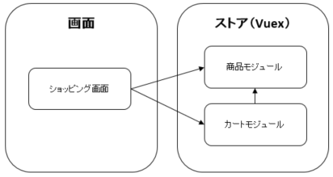
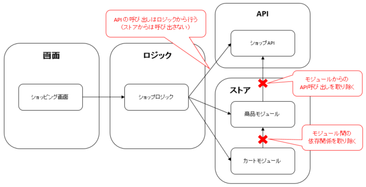

# TypeScript で Vuex を書いてみる

## Vuex の必要性

ある規模のアプリケーションになると、アプリケーションで扱うデータを管理する必要性が生じます。Vuex はこのようなアプリケーションのデータ管理をするためのライブラリになります。

ここで少しデータ管理を行う必要性について考えて見ましょう。

今後 SPA でアプリケーションを作成する機会が増えていくと考えられます。

SPA では API でサーバーから取得したデータをクライアントサイドに保管し、そのデータを各画面で共有するケースが多々あります。もし各画面で共有するデータを管理せず、その場しのぎで実装していくと間違いなくスパゲッティコード化していきます。

データ管理をしないアプリケーションでは次のような問題が発生します。

- 同じようなデータがいたるところに存在する
- データ更新ロジックがいたるところに存在するため、どれを使ったらよいか分からない
- 取得されたデータの出どころが分からないため、意図しないタイミングでデータが更新されてしまうことがある

Vuex のようなデータ管理ライブラリを使用することで、データが中央集権的に管理され、適切なデータの取得、編集を行うことができるようになります。

## Vuex で重要な単語

Vuex には重要な単語がいくつかありますが、最初はこの単語の意味を理解するのが大変です。

ここでは重要な単語とその役割について簡単に説明します。

### ストア

ストアはアプリケーションのデータを管理するコンテナで、以降で説明するすべての単語を内包する親玉みたいな存在です。

#### モジュール

モジュールは以降で説明する`ステート`、`ゲッター`、`ミューテーション`、`アクション`を管理するコンテナです。

##### ステート

ステートは意味のあるデータの塊です。モジュールはこのデータの塊を大事に管理します。

##### ゲッター

ゲッターはステートからデータを取り出し、利用者が扱いやすようデータを加工して提供します。

##### ミューテーション

ミューテーションはステートを編集をするための機能を提供します。

##### アクション

アクションは非同期なデータの取得、編集機能を提供します。

例えば REST API のように非同期でデータを取得、編集するような場合が対象となります。

アクションはステートを編集できません。このためステートを編集するにはミューテーションに依頼します。

## データモデルを設計する

ここではシンプルなショッピングカートのデータモデル設計を行い、Vuex の実装へ落とし込んでいきましょう。

モデル設計した結果、`ProductModule`と`CartModule`という 2 つのモジュールが作成されました。


次は`CartModule`を例に、Vuex の単語とどのようにひも付くかを表しています。


## 画面からストアを利用する

ここまででストアの実装は完了したので、次は画面からストアを利用する方法を見ていきましょう。

ストアを利用する方法はいくつかありますが、ここでは`mapGetters`、`mapMutations`、`mapActions`という Vuex が用意しているヘルパーを利用してストアにアクセスします。

ここではこれらのヘルパーを利用してストアにアクセスする方法を説明します。

### ゲッターを利用する

今回せっかく TypeScript を使用するので、タイプセーフ（型安全）にストアを利用するためのストア用定義ファイルを作成しました。

次はゲッターで使用するストア用定義の一部になります。

```js
export namespace CartTypes {
  export const PATH = 'cart'

  export const ITEMS = 'items'

  export type items = CartItem[]
}
```

次は画面からゲッターを利用するためのコードです。

`mapGetters`は`computed`に記述する必要があります。

ここでは`cart`モジュールの`items`というゲッターを`cartItems`という名前で使用するよう定義しています。

```js
import {mapGetters} from 'vuex'
import {CartTypes} from '@/store'

@Component({
  computed: {
    ...mapGetters(CartTypes.PATH, {
      cartItems: CartTypes.ITEMS,
    }),
  },
})
export default class ShoppingPage extends Vue {
  …
}
```

`mapGetters`で定義を行うと、テンプレートの中で定義したゲッターを使用することができます。

```html
<p v-show="!cartItems.length">
  <i>Please add some products to cart.</i>
</p>
```

### ミューテーションまたはアクションを利用する

ミューテーションとアクションもゲッターと使い方はほぼ同じで、違いとしては、`mapMutations`、`mapActions`は`methods`に記述する必要があるといった部分だけになります。

次はアクションで使用する定義の抜粋になります。

```js
export namespace CartTypes {
  export const PATH = 'cart'

  export const ADD_PRODUCT_TO_CART = 'addProductToCart'

  export type addProductToCart = (productId: string) => Promise<void>
}
```

次は画面からアクションを利用するためのコードです。

`mapGetters`は`computed`に記述する必要があります。

ここでは`cart`モジュールの`addProductToCart`というアクションをそのままの名前(`addProductToCart`)で使用するよう定義しています。

```js
import {mapActions} from 'vuex'
import {CartTypes} from '@/store'

@Component({
  methods: {
    ...mapActions(CartTypes.PATH, [CartTypes.ADD_PRODUCT_TO_CART]),
  },
})
export default class ShoppingPage extends Vue {
  addProductToCart!: CartTypes.addProductToCart

  async m_addButtonOnClick(product: Product): Promise<void> {
    await this.addProductToCart(product.id)
  }
}
```

また今回はゲッターの場合と異なり、定義したアクションをクラス（`ShoppingPage`）の中で使用しています。この場合`methods`でアクションを定義するだけではクラスの中で使用することができません。これは`this.addProductToCart`と記述してもコンパイラが`addProductToCart`というメソッドをクラスの中に見つけられないためです。

> NOTE: アクションに限らずゲッター、ミューテーションも同様です。

そこで TypeScript でアクション（またはゲッター、ミューテーション）を使用するにはクラスにアクションをインスタンス変数として定義する必要があります。それが`addProductToCart!: CartTypes.addProductToCart`の部分になります。

これでアクションが`this.addProductToCart(product.id)`のようにクラスの中で使用できるようになりました。

### TypeScript によるメリット

今回 Vuex を TypeScript で記述することにより、タイプセーフ（型安全）になり、次のようなメリットを受けることができます。

#### 名前の変更がしやすくなる

ストア用定義ファイルを作成したことにより、名前の変更がしやすくなります。

例えば`CartTypes.ITEMS`を`CartTypes.CART_ITEMS`へ変更すると、使用されている箇所がコンパイルエラーになるので影響範囲を特定することができます。

#### 適切な引数を渡すことができる

```js
export default class ShoppingPage extends Vue {

  addProductToCart!: CartTypes.addProductToCart
  // ↓ これと同意
  addProductToCart!: (productId: string) => Promise<void>

}
```

この例のように、クラスにアクションを型付きで定義することにより、適切な引数を渡すことができます。

例えば誤って number 型の値を引数に渡すとコンパイルエラーが発生します。

```js
this.addProductToCart(999);
```

また型定義されていることにより、利用者はメソッドの引数に「商品 ID を number 型で渡せばいいんだな」と明確に知ることができます。

#### シグネチャ変更がしやすくなる

引数の型が変わる、引数の数が増えるといったシグネチャの変更を行うと、使用している箇所がコンパイルエラーになるので、影響範囲を特定することが容易になります。

> NOTE: ただしテンプレートでミューテーションやアクションを使用している場合はコンパイルエラーが発生しないため、注意が必要です。

### 現時点での問題点

#### ストアにアクセスするための作法が多すぎる

画面からストアにアクセスするには`mapGetters`などを記述したり、さらにクラスからのアクセスではインスタンス変数を定義する必要があります。これは Vuex と TypeScript の仕組みを理解していない人には非常に分かりづらく感じられます。

#### ストアにアクセスするためのコードが多すぎる

画面からストアにアクセスするには、お作法に従ったコーディングを各画面でする必要があり、毎回同じようなコードを記述することになります。

#### 本質的にコードが読みづらい

画面からストアにアクセスするための`mapGetters`や、インスタンス変数の定義を見て直感的に何をしているか分かりづらく、初見殺しのコーディングになっています。

## ストアへのアクセス方法を改善する

現時点ではストアの利用には理解しづらいお作法に従う必要があり、直感的ではありません。

ストアは利用者に対してもっと分かりやすく、使いやすいインターフェイスを提供する義務があります。

ここではストアにアクセスしやすいインターフェイスの作成について説明していきます。

### Vuex のお作法を吸収する

画面からストアにアクセスするには Vuex のお作法と TypeScript が組み合わさり、非常に分かりづらいコーディングを行う必要がありました。

まず現在の画面とストアの関係を表す図を見てみましょう。画面はストア（Vuex）に直接アクセスしているので、Vuex のお作法に従わないとストアにアクセスできません。



そこで解決策として、Vuex のお作法を吸収する「ロジック」という中間層を作成します。

このロジックは Vuex のお作法を画面から吸収します。そして画面に対してはより扱いやすいインターフェイスを提供します。


この結果、画面からストアへのアクセスは次のように改善されました。

```html
<p v-show="!$logic.shop.cartItems.length">
  <i>Please add some products to cart.</i>
</p>
```

```js
async m_addButtonOnClick(product: Product): Promise<void> {
  await this.$logic.shop.addProductToCart(product.id);
}
```

今回の改善により、画面では Vuex のお作法に従ったコーディングを一切する必要はありません。ストアへのアクセスはすべて`$logic`から行うことができます。

試しに VSCode や WebStorm などの IDE で`this.$logic.`とタイプしてください。すると`shop`という候補が現れます。さらにドット（`.`）をタイプすると利用可能なゲッターやメソッドが表示されます。

### ロジックの実装

ロジックの実装は非常にシンプルです。画面からの要求をストアへ委譲しているにすぎません。

次はショップロジックの一部抜粋です。

```js
import { store } from "@/store";

@Component
export class ShopLogicImpl extends Vue implements ShopLogic {
  get cartItems(): CartItem[] {
    return store.getters[`${CartTypes.PATH}/${CartTypes.ITEMS}`];
  }

  addProductToCart(productId: string): Promise<void> {
    return store.dispatch(
      `${CartTypes.PATH}/${CartTypes.ADD_PRODUCT_TO_CART}`,
      productId
    );
  }
}
```

各ロジック（ショップロジックなど）を保持するロジックのコンテナも作成しました。

次のコードはロジックのコンテナをどの画面からでも簡単にアクセスできるようにしています。

```js
interface Logic {
  shop: ShopLogic;
}
```

```js
class LogicImpl implements Logic {
  constructor() {
    this.m_shop = new ShopLogicImpl();
  }

  m_shop: ShopLogic;

  get shop(): ShopLogic {
    return this.m_shop;
  }
}

export const logic: Logic = new LogicImpl();
Object.defineProperty(Vue.prototype, "$logic", {
  value: logic,
  writable: false
});
```

`src/types/vue.d.ts`

```js
import 'vue'
import {Logic} from '@/logic'

declare module 'vue/types/vue' {
  interface Vue {
    $logic: Logic
  }
}
```

以上により、画面からストアへのアクセスは`this.$logic.shop.cartItem`のように簡単に行うことができるようになりました。

### 改善された点

#### コーディングの量と複雑性が減少した

画面から Vuex のお作法に必要なコードがすべて排除されたため、かなりコーディング量を削減することができました。

また Vuex + TypeScript の組み合わせによる解読困難なコードを排除できたことで、コードが読みやすくなりました。

#### 直感的にストアにアクセスできるようになった

改善前はストアを利用するには、ストアで提供されているゲッター、ミューテーション、アクションを調べ、それを画面に定義し、やっとストアにアクセスすることができました。

今回の改善によってストアへのアクセスはロジックが提供しており、IDE のコード補完によって知ることができます。つまり`this.$logic.`とタイプすることにより、提供されている機能が一覧表示されるため、直感的なコーディングが可能になりました。

#### 画面が Vuex に依存しなくなった

Vuex に依存するコードがロジックに吸収されたことにより、画面は Vuex に依存しなくなりました。画面はストアの実装がどのようなライブラリを使用しているかを知りません。

つまりロジックのインターフェイスが変わらない限り、ストアの実装を Vuex 以外のライブラリに置き換えることが可能になりました。

### 現時点の問題点

#### モジュール間の依存関係

現在、カートモジュール（`CartModule`）は商品モジュール（`ProductModule`）に依存しています。まだモジュールの数が少ないので問題になりませんが、モジュールの数が増えた状態で依存関係がきちんと整理されていないと、どこかで循環参照が発生する確率が高まります。

このような状況に陥ることは非常に危険です。循環参照はある特定のルートのみで発生するケースが多く、テスト工程をすり抜ける可能性が多々あります。

#### ストアの実装がタイプセーフでない

Vuex によるストアの実装ではタイプセーフにならない箇所があります。

次はミューテーション実装のコードを抜粋したものです。

```js
context.commit(CartTypes.INCREMENT_ITEM_QUANTITY, product.id);
```

このコードは`incrementItemQuantity`というミューテーションに`product.id`を引数として渡しています。

このコードは IDE によるコード補完が効かないので、引数に何型の値を渡すべきかは、このミューテーションの定義まで移動して調べる必要があります。

また引数の`product.id`にどのような値を渡してもコンパイルエラーになりません。本来この引数には「string 型」の商品 ID を渡すべきなのですが、「number 型」の商品 ID を渡しても動作してしまう可能性があります。この状況は地雷が埋め込まれたようなもので、何かしらのタイミングで不具合として発火する可能性があります。

#### Vuex による実装が直感的でない

Vuex の実装は数々のお作法に従う必要があり、その作法を知らないと実装することはできません。

例として Vuex のストア実装とその作法がどのようなものか見てみましょう。

次のコードはあるアクションの実装を行っています。

```js
actions: ActionTree<CartState, RootState> = {

  // 1. アクションが受け取る引数の作法
  async [CartTypes.ADD_PRODUCT_TO_CART](context, productId: string): Promise<void> {
    // 2. ミューテーションの呼び出し作法
    context.commit(CartTypes.SET_CHECKOUT_STATUS, CheckoutStatus.None)
    // 3. 他のモジュールのゲッターの呼び出し作法
    const product: Product | undefined =
      context.rootGetters[`${ProductsTypes.PATH}/${ProductsTypes.GET_BY_ID}`](productId)
    if (!product) {
      throw new Error(`A Product that matches the specified productId "${productId}" was not found.`)
    }
    if (product.inventory > 0) {
      const cartItem = context.state.items.find(item => item.id === product.id)
      if (!cartItem) {
        context.commit(CartTypes.PUSH_PRODUCT_TO_CART, product)
      } else {
        context.commit(CartTypes.INCREMENT_ITEM_QUANTITY, product.id)
      }
      // 4. 他のモジュールのミューテーションの呼び出し作法
      context.commit(
        `${ProductsTypes.PATH}/${ProductsTypes.DECREMENT_INVENTORY}`,
        productId, {root: true})
    }
  },

}
```

1. アクションは第 1 引数に`context`を受け取り、第 2 引数に任意の引数を受け取ります。今回は引き数が 1 つなのでよいのですが、2 つ以上になる場合はオブジェクト形式で受け取る必要があります。
2. アクションはステートの編集ができません。ステートの編集はミューテーションに依頼する必要があります。ミューテーションの呼び出しは`commit()`を使用します（アクションの呼び出しの場合は`dispatch()`を使用します）。
3. 他のモジュールのゲッターへのアクセスは`context.rootGetters`経由で行います。`rootGetters`に対象となるゲッターのフルパス(`"products/getById"`)を指定することで対象のゲッターを使用することができます。ここでは引き数を受け取るゲッターを利用しているので、引き数に商品 ID を渡しています。
4. ここでは他のモジュールのミューテーションを呼び出す必要があるので、フルパス（`"products/decrementInventory"`）を指定しています。またフルパスを指定するにはオプションに`{root: true}`を指定する必要があります。

このコードを Vuex の勉強を始めたばかりの人が読み解くのはそれなりに難しいと思いますが、Vuex を知らない人はほとんど分からないのではないでしょうか。

勉強していないので分からないのはもちろんしょうがないことだと思いますが、文脈からある程度何をしているか分かるのが良いコードだと思います。

## Vuex をやめる

上記で示したように Vuex で実装することによりコードが複雑になるというデメリットがあります。

幸いにも現時点で画面は Vuex に依存しなくなっているので、Vuex 以外のストア実装を選択することができます。

ここでは Vuex をやめ、自前でストア実装する方法を説明していきます。

### モジュールを Vue コンポーネントへ置き換える

Vuex で実装されていたモジュールを Vue コンポーネントへ置き換えます。

次は Vue コンポーネント化したモジュールの一部抜粋です。

```js
export interface CartState {
  items: CartItem[]
  checkoutStatus: CheckoutStatus
}
```

```js
import Vue from "vue";
import { Component } from "vue-property-decorator";

@Component
export class CartModuleImpl extends Vue implements CartModule {
  m_state: CartState = {
    items: [],
    checkoutStatus: CheckoutStatus.None
  };

  get items(): CartItem[] {
    return this.m_state.items;
  }

  setCheckoutStatus(status: CheckoutStatus): void {
    this.m_state.checkoutStatus = status;
  }
}
```

モジュールがステートを保持する Vuex の仕様を引き継ぎ、今回は`m_state`という変数でステートを保持しています。

このステートは外部から直接アクセスできないようにプライベートな変数という位置づけにしています。

外部からステートにアクセスするには個別にゲッターなり、メソッドなりを提供し、これらを経由してステートにアクセスするようにしています。

- `items`というゲッターで、カートに入っているアイテム一覧を提供します。
- `setCheckoutStatus`というメソッド（Vuex でいうミューテーション）で、現在のチェックアウト状態を設定する機能を提供します。

### モジュール間の依存関係を取り除く

ここまでの実装では、モジュールがいわゆるビジネスロジック（業務処理の塊）の実装を担っていました。ビジネスロジックは複数のモジュールを横断したり、API を呼び出す必要が生じます。

このように複雑な処理はできれば共通的に利用できるようにし、重複したコードを書かないことが理想です。ただし共通的に利用できるビジネスロジックをモジュールに実装してしまうと、そのビジネスロジックを呼び出したいがためにモジュール間で相互依存の必要性が生じ、これが循環参照の原因になります。

このような理由でモジュールのビジネスロジックに関わる部分はロジックへ移動させる必要があります。

そこで以下の修正を行いました。

- モジュールで依存している箇所をショップロジック（`ShopLogic`）へ移動します。対象となるのは`CartModule.addProductToCart()`、`CartModule.checkout()`です。

- API の呼び出し箇所をショップロジック（`ShopLogic`）へ移動します。対象となるのは`ProductsModule.pullAll()`です。

この修正によりモジュールの役割がよりシンプルになりました。

モジュールは自身が保持するステートを管理することに専念するのみで、他のモジュールや API に依存しません。これにより循環参照の心配がなくなりました。

次は依存関係を改善した後の図です。



### 改善された点

#### ストアの実装がタイプセーフになった

ストアがタイプセーフになったことで IDE のコード補完の恩恵を受けることができるようになりました。

`import {store} from '@/store'`でストアのインポートを行い、`store.`とタイプしてみてください。`product`、`cart`というように利用可能なモジュール一覧が表示されます。

さらにドット（`.`）をタイプすると、そのモジュールで利用可能なゲッターやメソッドの一覧が表示され、直感的なコーディングが可能になります。

またタイプセーフになったことで、ゲッターやメソッドの名前変更、メソッドのシグネチャ変更も安全に行うことができるようになりました。

#### ストアの使い方が直感的に分かる

次はショップロジックの一部抜粋です。

```js
addProductToCart(productId: string): void {
  store.cart.setCheckoutStatus(CheckoutStatus.None)
  const product = store.products.getById(productId)
  if (!product) {
    throw new Error(`A Product that matches the specified productId "${productId}" was not found.`)
  }
  if (product.inventory > 0) {
    const cartItem = store.cart.items.find(item => item.id === product.id)
    if (!cartItem) {
      store.cart.addProductToCart(product)
    } else {
      store.cart.incrementItemQuantity(productId)
    }
    store.products.decrementInventory(productId)
  }
}
```

Vuex のお作法がなくなった分、ビジネスロジックの流れに集中できるようになり、どのような処理を行っているかが分かりやすくなったと思います。

#### 依存関係を改善することができた

依存関係を見直したことにより、循環参照の心配がなくなりました。

これにより、仕様変更や機能追加の際に「このモジュールを参照すると循環参照になるんじゃないか…」といった心配をする必要がなくなり、安全かつ柔軟にコーディングできるようになりました。

## まとめ

以上 Vuex を TypeScript で実装することで生じる課題とその解決案を提示してきました。

実際にアプリケーションを作成する際は Vuex を採用することがほとんどでしょう。

デファクトスタンダードな Vuex を採用する安心感もありますし、今後は Vuex が TypeScript でより実装しやすく改善されていくでしょう。

ただ Vuex 以外の選択肢もあることが認識いただけたかと思います。

今回の考察に異論はあると思いますが、それでもその考察が何かしらの役に立つことができたなら幸いです。
