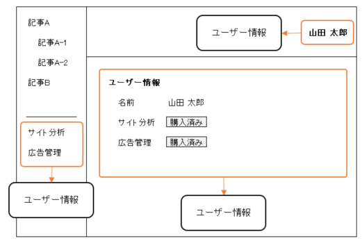
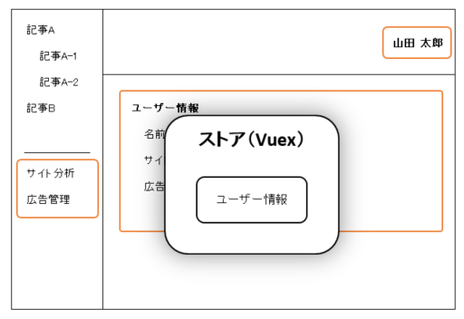
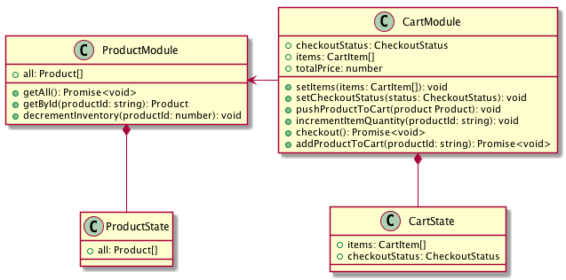
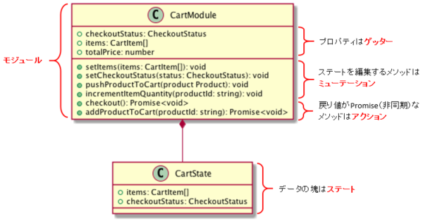
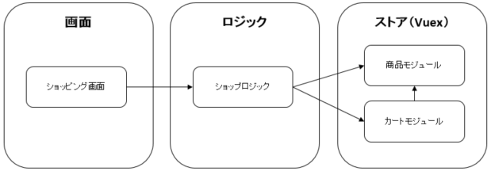

TypeScript で Vuex を書いてみる
===

###### Created by Masaaki Hojo ( [@masterpg](https://github.com/masterpg) )

---

# 要約

Vuex を TypeScript で書くことにより生じる問題点とその解決案を提示します。

またタイプセーフ（型安全）で、直感的なコーディングができるよう提案と改善を行っていきます。

<br>

* Vuex とは
<!--
Vuex の概要とその必要性について説明します。
-->
* Vuex で重要な単語
<!--
Vuex で登場する重要な単語について説明します。
-->
* 画面からストアを利用する
<!--
画面から Vuex のストアを利用するためのコーディングを見ていきます。
-->
* 画面からストアを利用する方法を改善する
<!--
画面から Vuex のストアを利用するためのコーディングを改善します。
-->

---

# Vuex とは

ある規模のアプリケーションになると、アプリケーションで扱うデータを管理する必要性が生じます。

Vuex はこのようなアプリケーションのデータ管理をするためのライブラリになります。

---

## データ管理を行う必要性について



<span style="font-size:22px">

このアプリケーションでは、各コンポーネントが別々のユーザー情報を参照しています。

ここでユーザー情報を変更したとすると、各ユーザー情報も同時に変更する必要があります。

ユーザー情報を参照するコンポーネントがもっと多かった場合、ユーザー情報の更新は複雑になり、更新もれなどの問題が発生しやすく、バグの原因になります。

</span>

---

## データ管理ライブラリを使いましょう



Vuex のようなデータ管理ライブラリを使用することで、データが中央集権的に管理され、適切なデータの取得、編集を行うことができるようになります。

<!--
分散していたユーザー情報が ストア（Vuex）に集約されました。またユーザー情報の取得、編集は必ずストアを経由することになります。
-->

---

# Vuex で重要な単語

Vuex には重要な単語がいくつかありますが、最初はこの単語の意味を理解するのが大変です。

重要な単語とその役割について簡単に説明します。

---

## ストア

ストアはアプリケーションのデータを管理するコンテナで、以降で説明するすべての単語を内包する親玉みたいな存在です。

---

## モジュール

モジュールは次に出てくる単語となる`ステート`、`ゲッター`、`ミューテーション`、`アクション`を管理するコンテナです。

---

## ステート

ステートは意味のあるデータの塊です。モジュールはこのデータの塊を大事に管理します。

---

## ゲッター

ゲッターはステートからデータを取り出し、利用者が扱いやすようデータを加工して提供します。

---

## ミューテーション

ミューテーションはステートを編集するための機能を提供します。

---

## アクション

アクションは<span style="color: red;">非同期</span>なデータの取得、編集機能を提供します。

例えば REST API のように非同期でデータを取得、編集するような場合が対象となります。

アクションはステートを編集できません。このためステートを編集するにはミューテーションに依頼します。

---

## データモデルを設計する

サンプルとしてショッピングカートのデータモデル設計を行いました。

モデル設計した結果、`ProductModule`と`CartModule`という 2 つのモジュールが作成されました。



---

### Vuex の単語とひも付ける

`CartModule`を例に、Vuex の単語とひも付けしてみます。



---

### データモデルを Vuex で実装する

はい、ソースコード、ばん！

---

# 画面からストアを利用する

ストアの実装は完了しているので、画面からストアを利用する方法を見ていきましょう。

<!--
「ふ〜ん、そんな感じで実装するんだ」みたいな軽い気持ちで聞いてもらってOKです！
-->

---

## ストアを利用すためのお作法

ストアを利用する方法はいくつかありますが、ここでは`mapGetters`、`mapMutations`、`mapActions`という Vuex が用意しているヘルパーを利用してストアにアクセスします。

---

## ゲッターを利用する

今回せっかく TypeScript を使用するので、タイプセーフ（型安全）にストアを利用するためのストア用定義ファイルを作成しました。

次はゲッターで使用するストア用定義の抜粋になります。

```ts
export namespace CartTypes {
  export const PATH = 'cart'

  export const ITEMS = 'items'
}
```

---

次は画面からゲッターを利用するためのコードです。

`mapGetters`は`computed`に記述する必要があります。

ここでは`cart`モジュールの`items`というゲッターを`cartItems`という名前で使用するよう定義しています。

<span style="font-size:22px">


```ts
import {mapGetters} from 'vuex'
import {CartTypes} from '@/store'

@Component({
  computed: {
    ...mapGetters(CartTypes.PATH, {
      cartItems: CartTypes.ITEMS,
    }),
  },
})
export default class ShoppingPage extends Vue {
  …
}
```

</span>

---

`mapGetters`で定義を行うと、テンプレートの中で定義したゲッターを使用することができます。

```html
<p v-show="!cartItems.length">
  <i>Please add some products to cart.</i>
</p>
```
---

## ミューテーションまたはアクションを利用する

ミューテーションとアクションもゲッターと実装内容はほぼ同じで、違いとしては、`mapMutations`、`mapActions`は`methods`に記述するといった部分だけになります。

次はアクションで使用するストア定義の抜粋になります。

<span style="font-size:22px">

```ts
export namespace CartTypes {
  export const PATH = 'cart'

  export const ADD_PRODUCT_TO_CART = 'addProductToCart'

  export type addProductToCart = (productId: string) => Promise<void>
}
```

</span>

---

次は画面からアクションを利用するためのコードです。

`mapActions`は`methods`に記述する必要があります。

ここでは`cart`モジュールの`addProductToCart`というアクションをそのままの名前(`addProductToCart`)で使用するよう定義しています。

<!--
今回はゲッターの場合と異なり、定義したアクションをクラス（ShoppingPage）の中で使用しています。この場合methodsでアクションを定義するだけではクラスの中で使用することができません。これはthis.addProductToCartと記述してもコンパイラがaddProductToCartというメソッドをクラスの中に見つけられないためです。

そこで TypeScript でアクション（またはゲッター、ミューテーション）を使用するにはクラスにアクションをインスタンス変数として定義する必要があります。それが`addProductToCart: CartTypes.addProductToCart`の部分になります。

これでアクションが`this.addProductToCart(product.id)`のようにクラスの中で使用できるようになりました。
-->

<span style="font-size:22px">

```ts
import {mapActions} from 'vuex'
import {CartTypes} from '@/store'

@Component({
  methods: {
    ...mapActions(CartTypes.PATH, [CartTypes.ADD_PRODUCT_TO_CART]),
  },
})
export default class ShoppingPage extends Vue {
  addProductToCart: CartTypes.addProductToCart

  async m_addButtonOnClick(product: Product): Promise<void> {
    await this.addProductToCart(product.id)
  }
}
```

</span>

---

## TypeScript によるメリット

今回 Vuex を TypeScript で記述したことにより、タイプセーフ（型安全）になり、次のようなメリットを受けることができます。

---

### 名前の変更がしやすくなる

ストア用定義ファイルを作成したことにより、名前の変更がしやすくなります。

例えば`CartTypes.ITEMS`を`CartTypes.CART_ITEMS`へ変更すると、使用されている箇所がコンパイルエラーになるので影響範囲を特定することができます。

---

### 適切な引数を渡すことができる

<span style="font-size:22px">

```ts
export default class ShoppingPage extends Vue {

  addProductToCart: CartTypes.addProductToCart
  // ↓ これと同意
  addProductToCart: (productId: string) => Promise<void>

}
```

</span>

この例のように、クラスにアクションを型付きで定義することにより、適切な引数を渡すことができます。

例えば誤って number 型の値を引数に渡すとコンパイルエラーが発生します。

<span style="font-size:22px">
  
```ts
this.addProductToCart(999);
```

</span>

また型定義されていることにより、利用者はメソッドの引数に「商品 ID を number 型で渡せばいいんだな」と明確に知ることができます。

---

## 現時点での問題点

---

### ストアにアクセスするためのお作法が多すぎる

画面からストアにアクセスするには`mapGetters`などを記述したり、さらにクラスからのアクセスではインスタンス変数を定義する必要があります。

これは Vuex と TypeScript の仕組みを理解していない人には非常に分かりづらく感じられます。

---

### ストアにアクセスするためのコードが毎回必要

画面からストアにアクセスするには、作法に従ったコーディングを各画面でする必要があり、毎回同じようなコードを記述することになります。

---

### 本質的にコードが読みづらい

画面からストアにアクセスするための`mapGetters`や、インスタンス変数の定義を見て直感的に何をしているか分かりづらく、初見殺しのコーディングになっています。

---

# ストアへのアクセス方法を改善する

現時点ではストアの利用には理解しづらいお作法に従う必要があり、直感的ではありません。

ストアは利用者に対してもっと分かりやすく、使いやすいインターフェイスを提供するべきです。

ここではストアにアクセスしやすいインターフェイスの作成について説明していきます。

---

## Vuex のお作法を吸収する

画面からストアにアクセスするには Vuex のお作法と TypeScript が組み合わさり、非常に分かりづらいコーディングを行う必要がありました。

まず現在の画面とストアの関係を表す図を見てみましょう。画面はストア（Vuex）に直接アクセスしているので、Vuex のお作法に従わないとストアにアクセスできません。


---

そこで解決策として、Vuex のお作法を吸収する「ロジック」という中間層を作成します。

このロジックは Vuex のお作法を画面から吸収します。そして画面に対してはより扱いやすいインターフェイスを提供します。



---


この結果、画面からストアへのアクセスは次のように改善されました。

<!--
今回の改善により、画面では Vuex のお作法に従ったコーディングを一切する必要はありません。ストアへのアクセスはすべて`$logic`から行うことができます。

試しに VSCode や WebStorm などの IDE で`this.$logic.`とタイプしてください。すると`shop`という候補が現れます。さらにドット（`.`）をタイプすると利用可能なゲッターやメソッドが表示されます。
-->

<span style="font-size:22px">

```html
<p v-show="!$logic.shop.cartItems.length">
  <i>Please add some products to cart.</i>
</p>
```

```ts
async m_addButtonOnClick(product: Product): Promise<void> {
  await this.$logic.shop.addProductToCart(product.id);
}
```

</span>

---

ロジックの実装は非常にシンプルです。画面からの要求をストアへ委譲しているにすぎません。

次はショップロジックの一部抜粋です。

<span style="font-size:22px">
  
```ts
import {store} from "@/store";

@Component
export class ShopLogicImpl extends Vue implements ShopLogic {
  get cartItems(): CartItem[] {
    return store.getters[`${CartTypes.PATH}/${CartTypes.ITEMS}`]
  }

  addProductToCart(productId: string): Promise<void> {
    return store.dispatch(
      `${CartTypes.PATH}/${CartTypes.ADD_PRODUCT_TO_CART}`, productId
    )
  }
}
```

</span>

---

次のコードはロジックをどの画面からでも簡単にアクセスできるようにしています。

<span style="font-size:16px">

```ts
interface Logic {
  shop: ShopLogic
}
```

```ts
class LogicImpl implements Logic {
  m_shop: ShopLogic = new ShopLogicImpl()

  get shop(): ShopLogic {
    return this.m_shop
  }
}

export const logic: Logic = new LogicImpl()
Object.defineProperty(Vue.prototype, "$logic", {
  value: logic,
  writable: false
})
```

```ts
import 'vue'
import {Logic} from '@/logic'

declare module 'vue/types/vue' {
  interface Vue {
    $logic: Logic
  }
}
```

</span>

---

## 改善された点

---

### コーディングの量と複雑性が減少した

画面から Vuex のお作法に必要なコードがすべて排除されたため、かなりコーディング量を削減することができました。

また Vuex + TypeScript の組み合わせによる解読困難なコードを排除できたことで、コードが読みやすくなりました。

---

### 直感的にストアにアクセスできるようになった

改善前はストアを利用するには、ストアで提供されているゲッター、ミューテーション、アクションを調べ、それを画面に定義し、やっとストアにアクセスすることができました。

今回の改善によってストアへのアクセスはロジックが提供しており、IDE のコード補完によって知ることができます。つまり`this.$logic.`とタイプすることにより、提供されている機能が一覧表示されるため、直感的なコーディングが可能になりました。

---

### 画面が Vuex に依存しなくなった

Vuex に依存するコードがロジックに吸収されたことにより、画面は Vuex に依存しなくなりました。画面はストアの実装がどのようなライブラリを使用しているかを知りません。

つまりロジックのインターフェイスが変わらない限り、ストアの実装を Vuex 以外のライブラリに置き換えることが可能になりました。

---

# まとめ

以上 Vuex を TypeScript で実装することで生じる課題とその解決案を提示してきました。

実際にアプリケーションを作成する際は Vuex を採用することがほとんどでしょう。

デファクトスタンダードな Vuex を採用する安心感もありますし、今後は Vuex が TypeScript でより実装しやすく改善されていくでしょう。

ただ今日提示したような改善案もあるのではないでしょうか。

今回の考察に異論はあると思いますが、それでもこの考察が何かしらの役に立つことができたなら幸いです。
